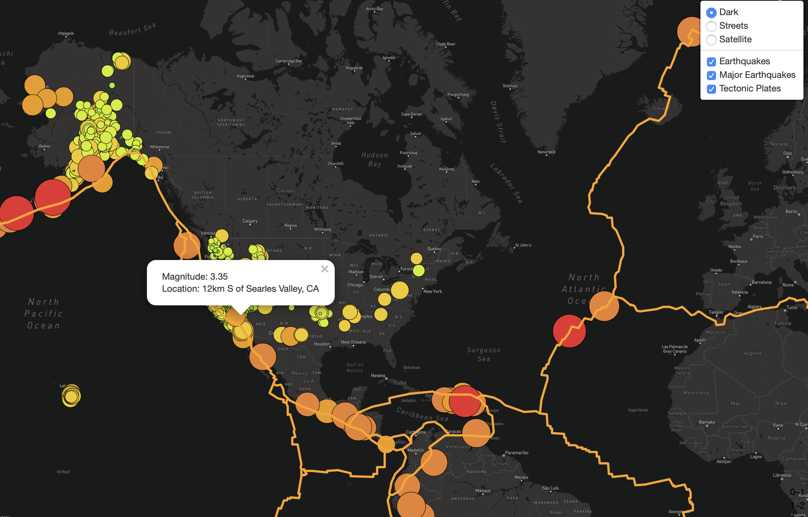

# Mapping_Earthquakes

In this project, we are helping Basil and Sadhana to create an earthquake map with two different maps and the earthquake overlay. The map contains the earthquakes in the past 7 days, major earthquales with a magnitude greater than 4.5, and the tectonic plates. Also, we have set up three title layers, which are dark, street, and satellite for the users to pick. In addition, the data is taken from USGS website that updates every 5 minutes. 

  Please see Figure 1 for details:
 
  Figure 1: Visualizations.